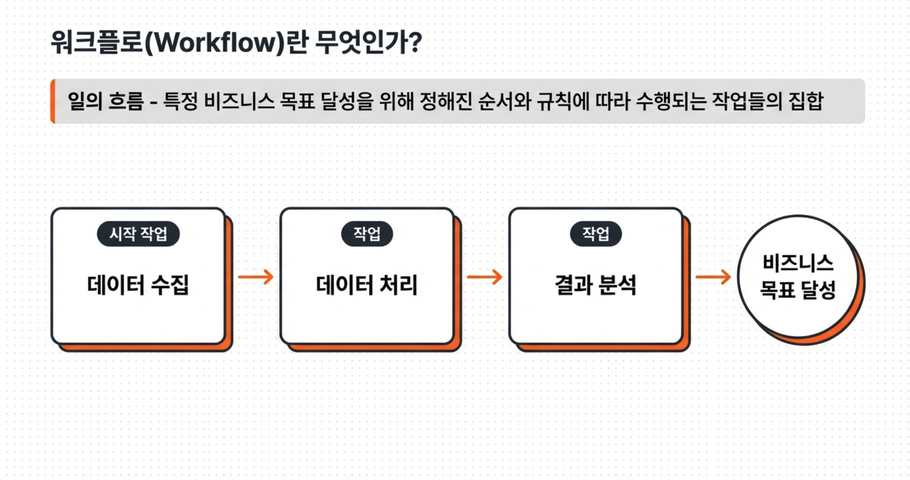
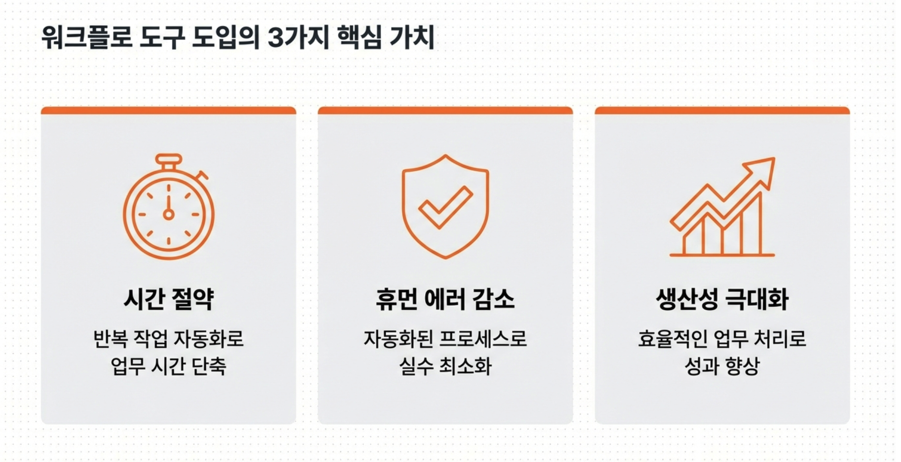
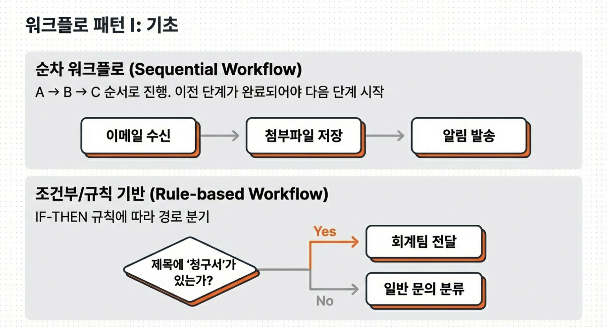
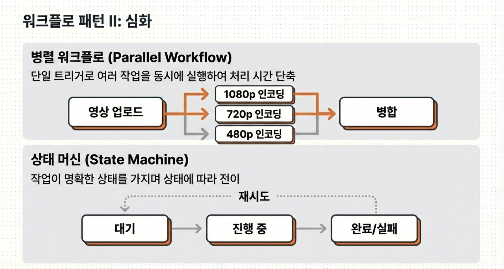
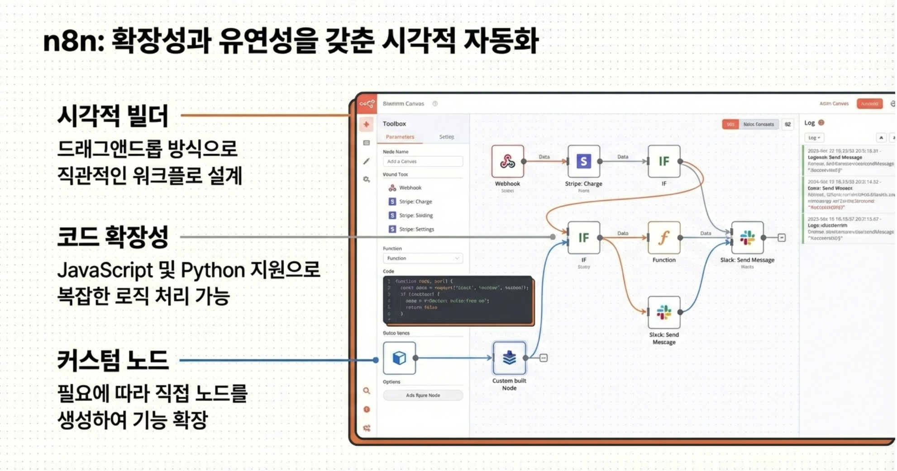
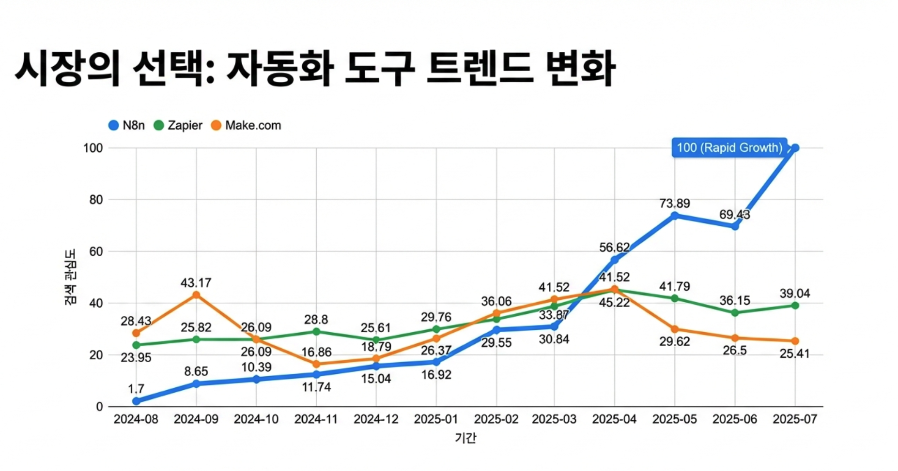
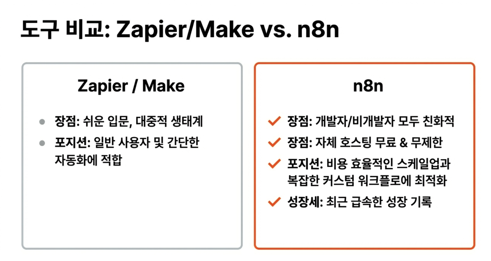
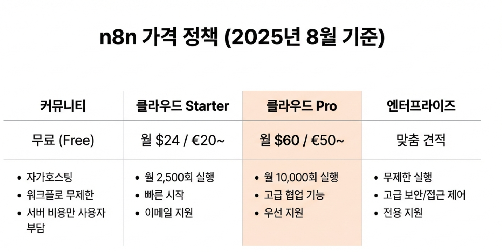
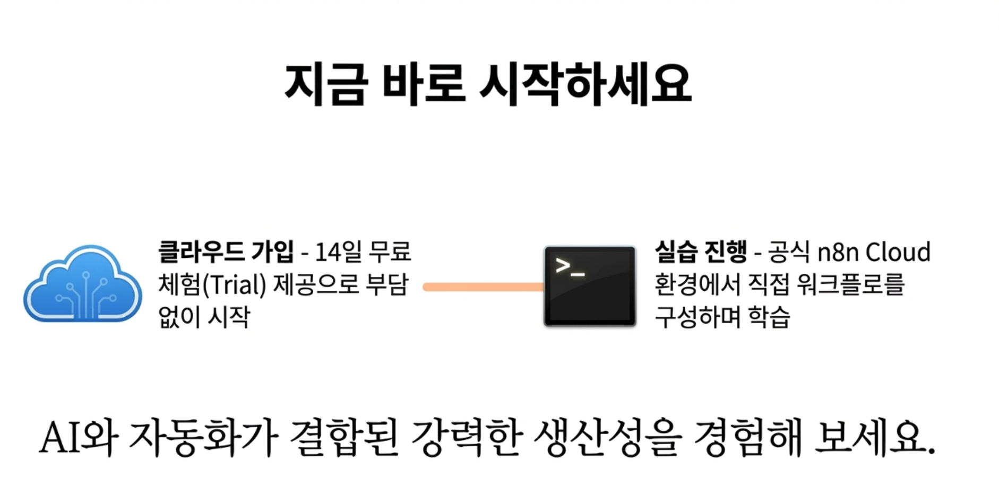

 

**강의의 주제:** '자동화의 심장'이라 불리는 **n8n**의 기초를 다루는 파트입니다.

**학습 목표:** 업무 자동화의 핵심 개념인 '워크플로'가 무엇인지 정의하고, 이를 구현하는 도구인 n8n을 이해하는 것이 목적입니다.

 

 
**워크플로의 정의:** 단순히 일을 하는 것이 아니라, **특정 비즈니스 목표를 달성하기 위해 정해진 순서와 규칙에 따라 수행되는 작업들의 집합**을 의미합니다. 즉, "일의 흐름"을 설계하는 것입니다.

* **표준 프로세스 예시:**
1. **시작:** 워크플로를 작동시키는 트리거 단계.
2. **작업 1 (데이터 수집):** 필요한 정보를 모으는 단계.
3. **작업 2 (데이터 처리):** 수집된 정보를 목적에 맞게 가공하는 단계.
4. **작업 3 (결과 분석):** 처리된 데이터를 분석하여 가치를 만드는 단계.
5. **비즈니스 목표:** 최종적으로 얻고자 하는 성과.

 

**워크플로 도구 도입의 3대 장점:**

- **시간 절약:** 반복적인 업무를 자동화하여 실제 업무 시간을 획기적으로 단축합니다.
- **휴먼 에러 감소:** 사람이 수동으로 할 때 발생할 수 있는 실수를 자동화된 프로세스로 최소화합니다.
- **생산성 극대화:** 효율적인 업무 처리를 통해 개인과 조직의 성과를 향상시킵니다.

 

상황에 따라 워크플로는 다양한 형태로 설계될 수 있습니다.

- **순차 워크플로 (Sequential):** 가장 기본적인 형태로, A가 끝나야 B가 시작되는 일직선 구조입니다.
- **조건부/규칙 기반 (Rule-based):** `IF-THEN` 논리에 따라 경로가 갈라집니다. 예를 들어, 이메일 제목에 '청구서'가 포함되어 있으면 회계팀으로 보내고, 아니면 일반 문의로 분류하는 방식입니다.

 

- **병렬 워크플로 (Parallel):** 하나의 시작점(트리거)에서 여러 작업을 동시에 실행하여 시간을 단축합니다. 영상 업로드 시 1080p, 720p, 480p 인코딩을 동시에 진행하는 것이 대표적입니다.
- **상태 머신 워크플로 (State Machine):** 작업이 '대기 → 진행 중 → 완료/실패'와 같이 명확한 상태를 가지며, 그 상태 변화에 따라 다음 동작이 결정되는 복잡한 구조입니다.

 

n8n이 다른 도구들에 비해 강력한 이유는 다음과 같습니다.

- **시각적 빌더와 확장성:** 마우스로 노드를 끌어다 놓는 드래그 앤 드롭 방식을 지원하며, 필요할 경우 JavaScript나 Python 코드를 직접 작성해 기능을 무한히 확장할 수 있습니다.
- **커스텀 노드:** 1,000개 이상의 기본 통합 기능을 제공할 뿐만 아니라, 사용자가 직접 노드를 만들어 복잡한 요구사항에도 대응할 수 있습니다.
- **통합 및 보안:** 기업의 데이터 주권을 지킬 수 있도록 **자체 호스팅(Self-hosting)**이 가능하여 보안성이 매우 뛰어납니다.

 
 
 

최근 자동화 도구 시장에서 n8n의 성장세가 두드러집니다.

- **검색 관심도 급상승:** 2024년 8월부터 2025년 7월 사이의 트렌드를 보면, n8n에 대한 관심도가 Zapier나 Make.com을 압도하며 급속도로 성장하고 있음을 알 수 있습니다.
- **도구별 특징 비교:**
- **Zapier/Make:** 입문이 쉽고 대중적인 생태계를 가지고 있지만, 사용량에 따른 비용 부담이 있을 수 있습니다.
- **n8n:** 개발자와 비개발자 모두에게 친화적이며, 특히 **자체 호스팅 시 무료로 무제한 실행**이 가능하다는 점이 가장 큰 경쟁력입니다.

 
- **커뮤니티(자가호스팅):** 개인이나 소규모 사용자가 서버 비용만 부담하면 **무료로 무제한 실행**할 수 있는 가장 가성비 높은 옵션입니다.
- **비즈니스/엔터프라이즈:** 기업용 보안 기능(SSO, Git 관리, SLA 등)이 추가되며 실행 기반으로 과금되거나 맞춤 견적을 통해 제공됩니다.
- **클라우드 플랜:** n8n 측에서 서버를 관리해 주는 유료 서비스로, Starter(월 $24~), Pro(월 $60~) 등의 옵션이 있으며 설치 과정 없이 빠르게 시작할 수 있습니다.

마지막으로 실제 사용을 위한 첫 단계입니다.

- **클라우드 가입:** n8n Cloud는 **14일간 무료 체험(Trial)**이 가능하므로, 별도의 서버 구축 없이도 바로 자동화를 실습해 볼 수 있습니다.

