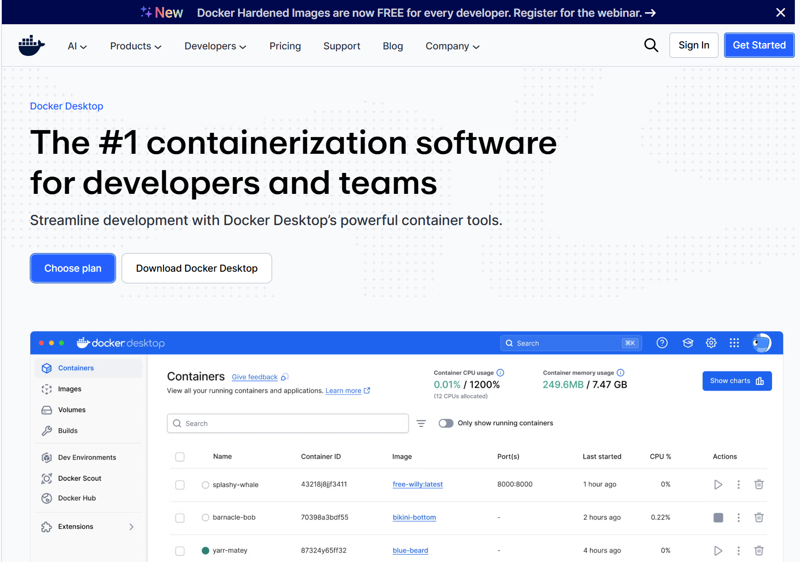  
먼저 도커 홈페이지에 접속해서 도커 데스크탭을 다운로드 한다. 

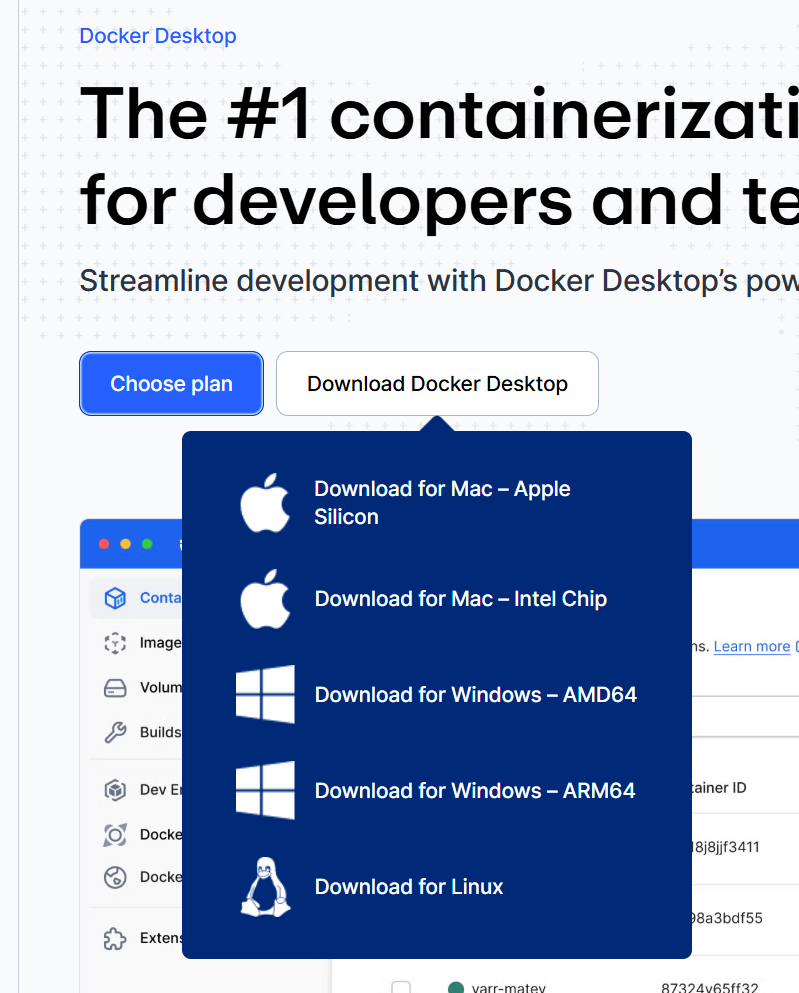  
본인의 PC에 맞는 파일을 선택하면 되는데 일반적으로는 다음과 같이 선택하면 된다. 
- 일반적인 Windows 이용자 (Download for Windows -AMD64)
- Windows PC이지만 인텔이나 AMD사의 CPU가 아니라 퀄컴의 스넵드레곤이 장착된 모델 (Download for Windows - AMD64)
- M1, M2, M3, M4 등등 비교적 신형은 Mac 사용자 (Download for Mac - Apple Silicon)

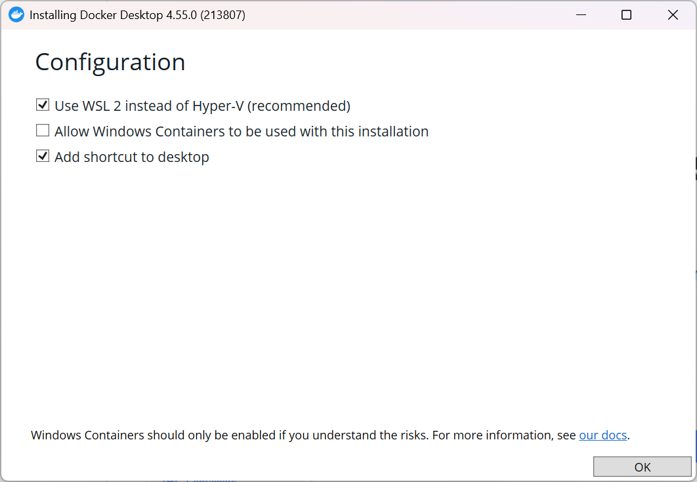  
다운로드 받은 파일을 설치한다. Windows 사용자는 Use WSL 2 insted of Hyper-v (recommended) 항목이 체크되어야 한다.

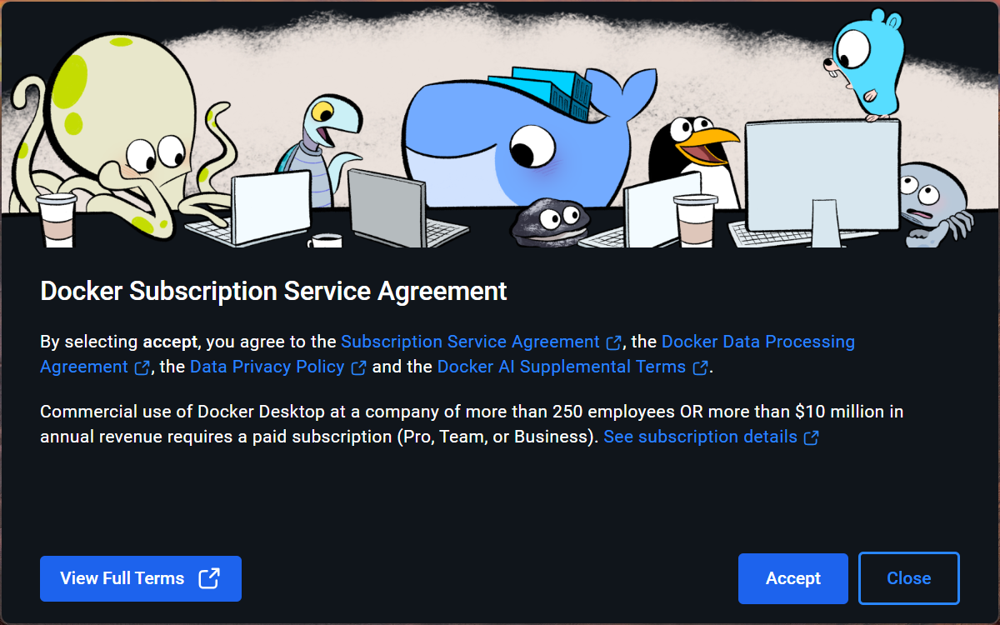  
설치가 끝나면 라이선스에 Accept 해준다.

  
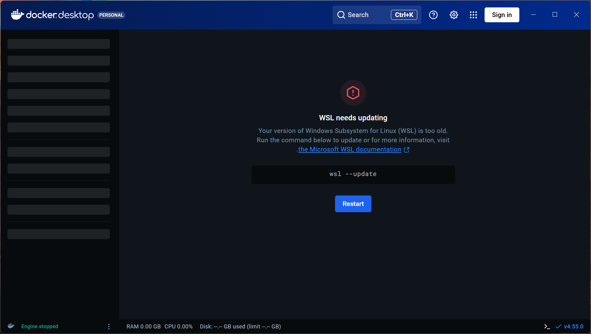  
Windows 사용자들 중에 WSL의 버전이 낮거나 설치 되지 않은 사람은 추가로 명령 프롬프트를 열고 화면에 보이는 wsl --update 명령을 입력하고 restart 버튼을 다시 누른다. 
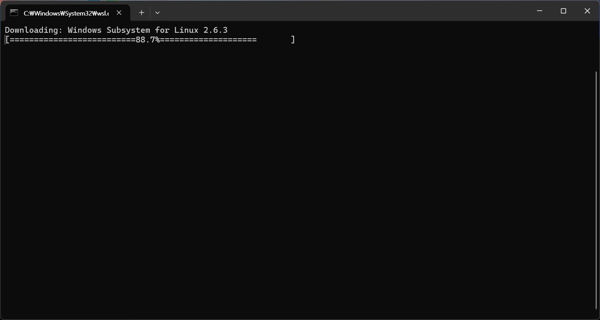  
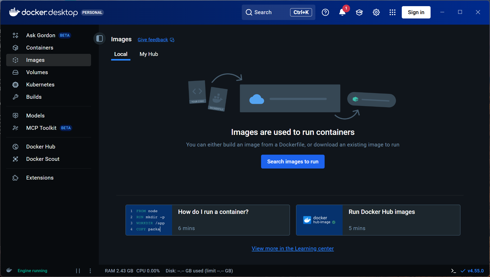  
여기까지 하고 나면 Docker Desktop의 설치가 끝난다. 

  
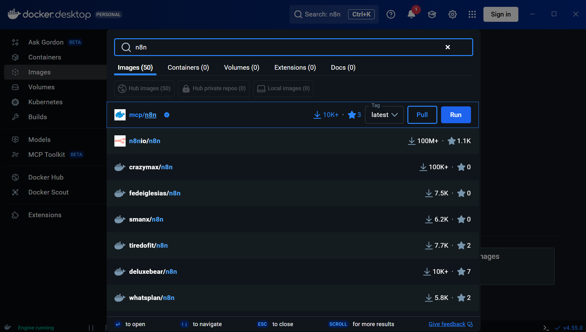  
왼쪽 메뉴에서 Image를 선택하고 Search images to run을 선택해서 n8n을 실행하기 위한 이미지를 검색한다. 
n8n으로 검색하고 나서 **n8nio/n8n** 을 선택해고 Pull 버튼을 눌러서 이미지를 다운로드 한다. 

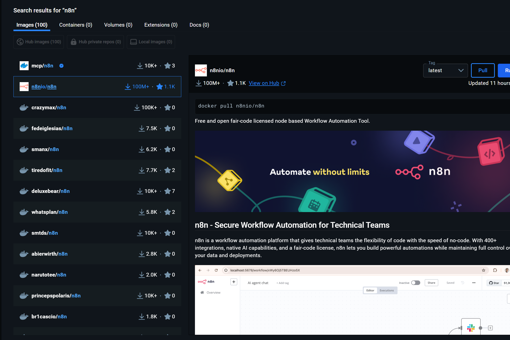  
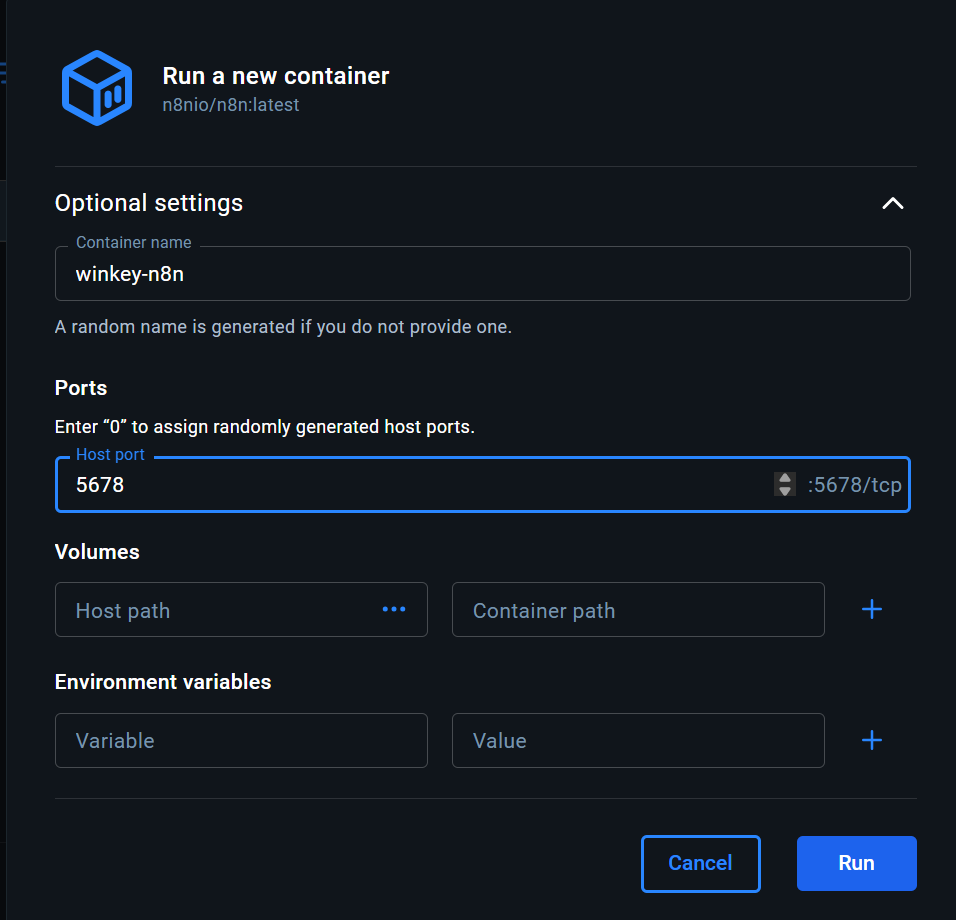  
다운로드가 끝나면 Run을 선택해서 해당 이미지를 컨테이너로 만들면서 실행하게 되는데 컨테이너의 이름과 포트 등을 입력한 다음 Run을 눌러서 실행한다. 

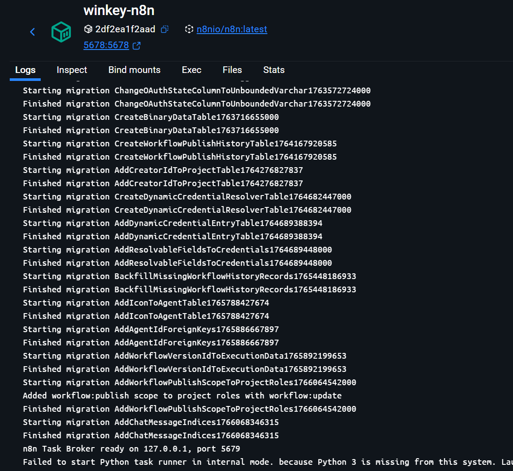  
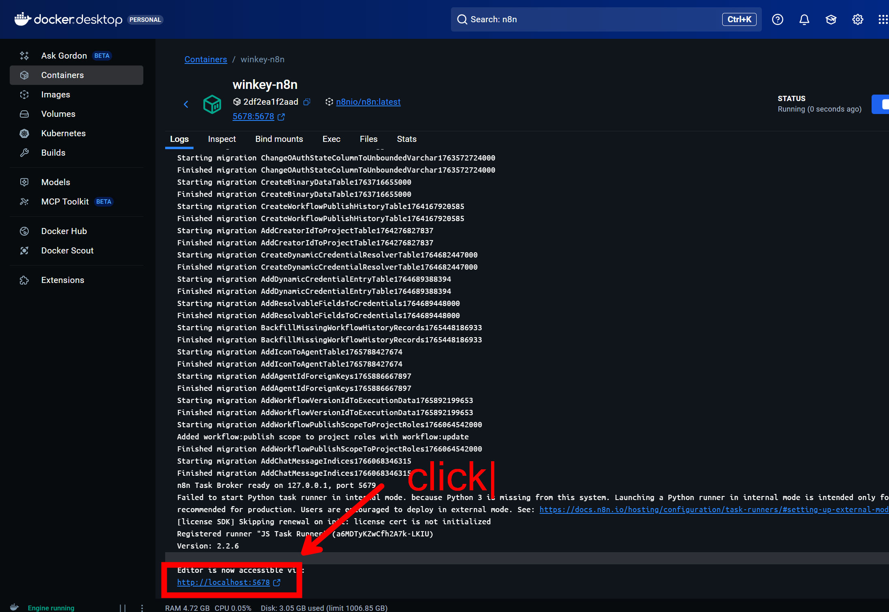  
실행이 끝나면 아래쪽에 링크를 클릭해서 n8n 사이트를 띄워본다. 

