  
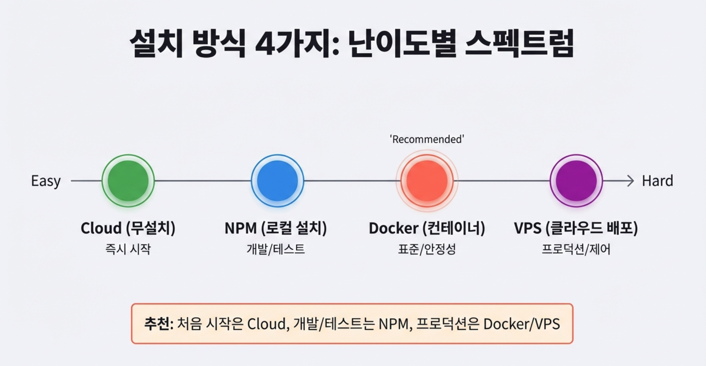  
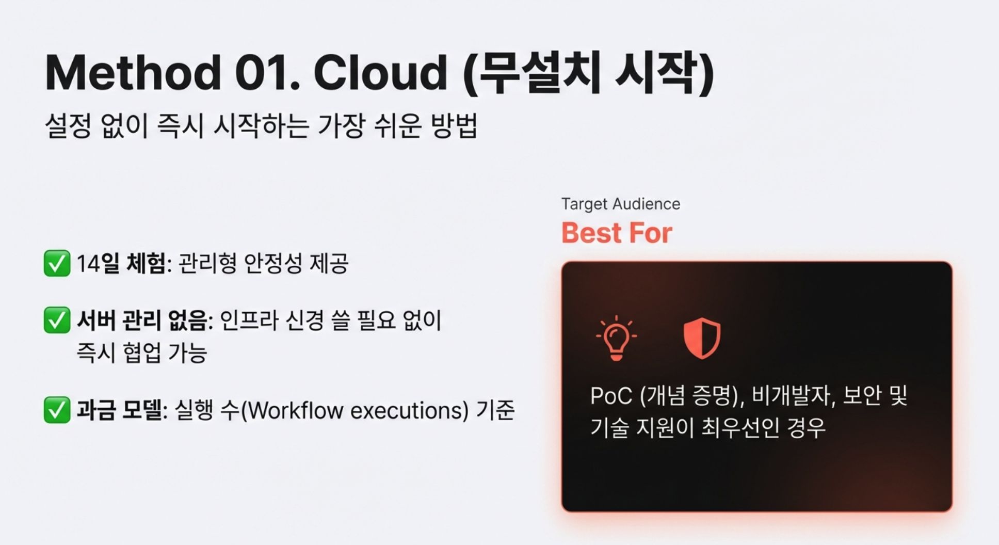  
n8n은 난이도와 목적에 따라 크게 네 가지 방식으로 설치할 수 있습니다.

- **Cloud (가장 쉬움):** 별도의 설치 과정 없이 웹 브라우저만 있으면 즉시 시작할 수 있는 방식입니다. 모든 관리가 자동으로 이루어져 매우 편리합니다.
- **NPM (쉬움):** 사용자의 PC(로컬)에 직접 설치하는 방식입니다. Node.js 환경이 필요하며, 로컬 개발 및 테스트에 적합합니다.
- **Docker (보통):** 컨테이너 기술을 활용하여 격리된 환경에서 실행하는 방식입니다. 일관된 실행 환경을 보장하며 프로덕션 준비 단계에서 권장됩니다.
- **VPS (어려움):** 외부 클라우드 서버에 배포하는 방식입니다. 서버 설정, 도메인 연결, SSL 인증서 적용 등이 필요하여 난이도가 높지만 전문적인 운영이 가능합니다.
- **추천 가이드:** 처음 시작은 **Cloud**, 개발과 테스트는 **NPM**, 실제 업무용(프로덕션)은 **Docker/VPS** 방식을 추천합니다.

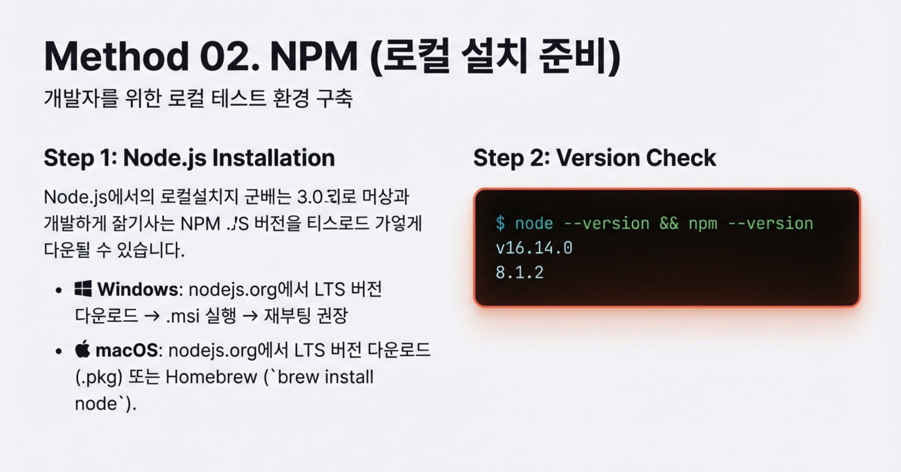  
서버 관리의 부담 없이 가장 빠르게 자동화를 시작할 수 있는 방법입니다.

- **특장점:** 14일 무료 체험 기간을 제공하며, 서버 관리가 필요 없어 안정성이 높고 팀 간 즉시 협업이 가능합니다.
- **과금 체계:** 워크플로 실행 횟수를 기준으로 비용이 발생합니다.
- **권장 대상:** 기술적 검증(PoC) 단계, 비개발자, 혹은 보안 및 기술 지원을 최우선으로 하는 사용자에게 적합합니다.

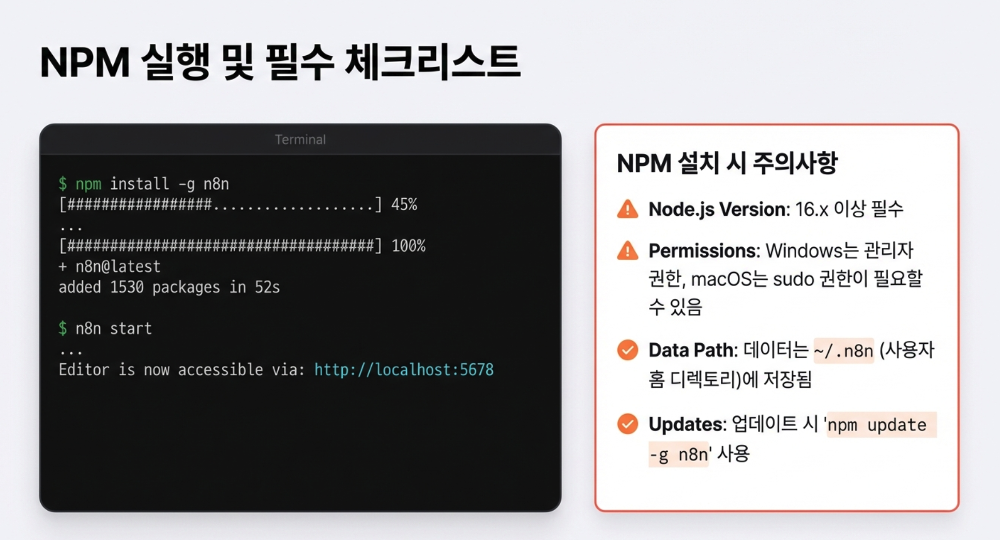  
사용자의 PC 운영체제에 맞춰 n8n을 설치하는 단계별 방법입니다.
1. **Node.js 설치:** 공식 홈페이지에서 LTS 버전을 다운로드하여 설치합니다. Windows는 `.msi`, macOS는 `.pkg` 파일을 사용하며, 설치 후 재부팅이 권장됩니다.
2. **버전 확인:** 터미널(또는 CMD)에서 `node --version`과 `npm --version` 명령어로 설치 여부를 확인합니다. Node.js 16.x 이상 버전이 반드시 필요합니다.
3. **n8n 설치:** `npm install -g n8n` 명령어를 입력합니다. 관리자 권한이나 `sudo`가 필요할 수 있습니다.
4. **실행:** `n8n start` 명령어를 입력하면 로컬 서버가 실행되며, 기본적으로 `http://localhost:5678`을 통해 접속할 수 있습니다.
- **추가 팁:** 데이터는 사용자 홈 디렉토리의 `.n8n` 폴더에 저장되며, 정기적인 백업이 필수입니다. 프로덕션 환경에서는 중단 없는 실행을 위해 PM2 사용을 고려해야 합니다.

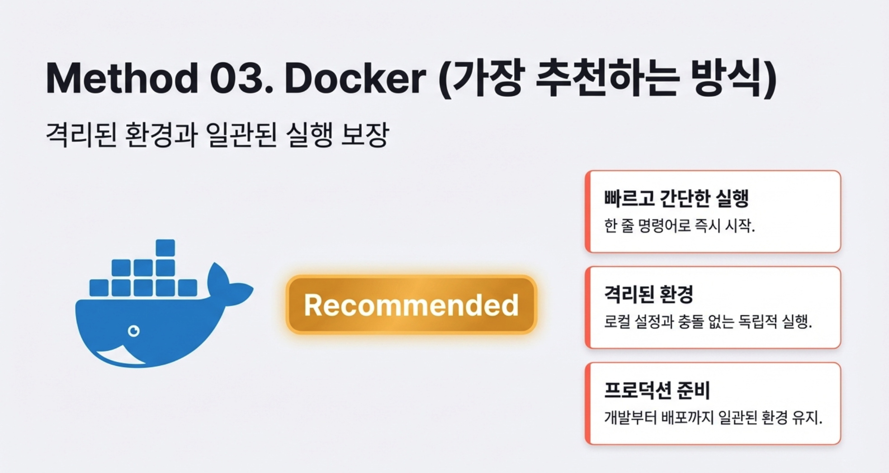  
## **슬라이드 6: 로컬 설치 ② Docker (강력 추천)**

Docker는 복잡한 환경 설정을 깔끔하게 해결해 주는 권장 설치 방식입니다.
- **Docker CLI 방식:** `docker run` 한 줄 명령어로 즉시 시작할 수 있어 테스트 및 개발에 최적입니다. 다만 설정이 복잡해질수록 명령어가 길어지는 단점이 있습니다.
- **Docker Compose 방식 (추천):** `docker-compose.yml` 설정 파일을 작성하여 관리하는 방식입니다. 설정의 재사용성이 높고 여러 서비스를 동시에 연동하기 쉬워 프로덕션 환경에 매우 적합합니다.
- **데이터 영구 저장:** 컨테이너가 삭제되어도 데이터가 사라지지 않도록 `-v` 옵션을 사용하여 호스트와 볼륨을 연결해야 합니다.
- **관리 명령어:** 실행은 `docker-compose up -d`, 중지는 `down`, 로그 확인은 `logs -f` 명령어를 사용합니다.

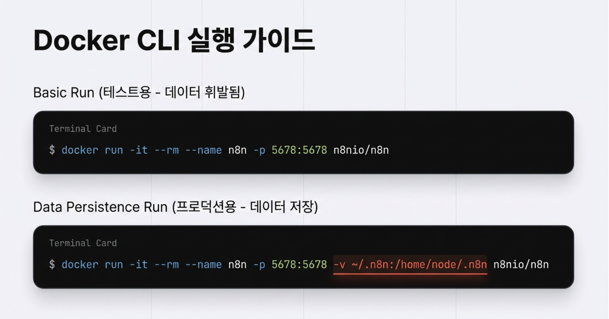  
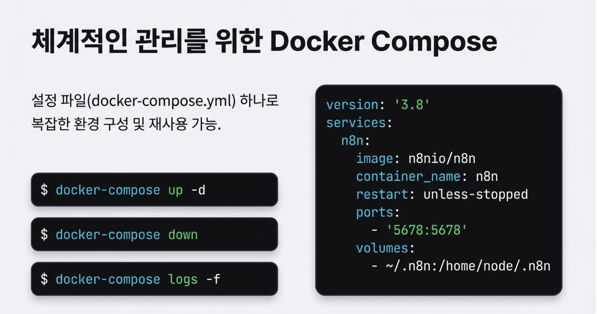  
자체 서버를 운영하려는 경우 선택할 수 있는 다양한 서비스 플랫폼 비교입니다.
- **서비스별 특징:**
- **DigitalOcean (종합 1위):** 월 $6부터 시작하며, 문서화가 잘 되어 있고 안정적이어서 가장 균형 잡힌 선택입니다.
- **Hetzner (가성비 1위):** 월 약 €4(6,500원)로 가장 저렴하면서도 높은 성능을 제공하는 유럽 기반 서버입니다.
- **Railway (입문자 1위):** 월 $5부터 시작하며, Git 자동 배포와 템플릿을 지원하여 설치 경험이 매우 쉽습니다.
- **기타:** 한국 리전이 많은 **Vultr**, 글로벌 엣지 기능을 제공하는 **Fly.io**, 기업용 엔터프라이즈 환경에 적합한 **AWS/Azure** 등이 있습니다.

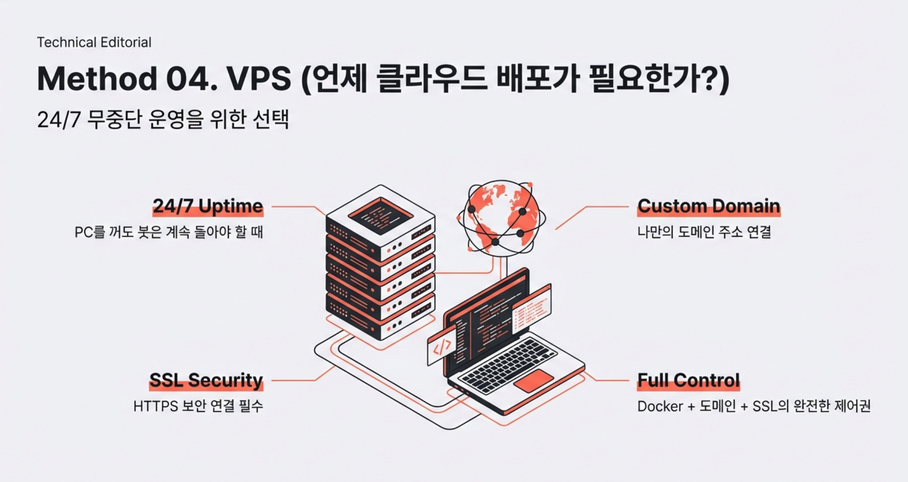  
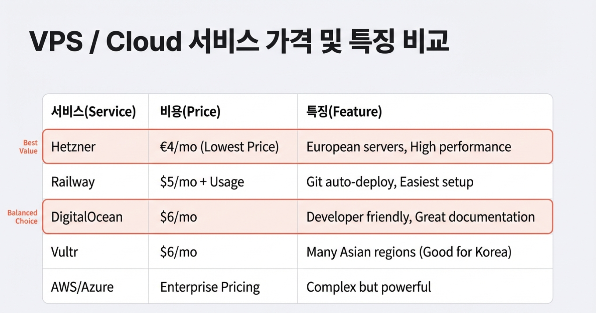  
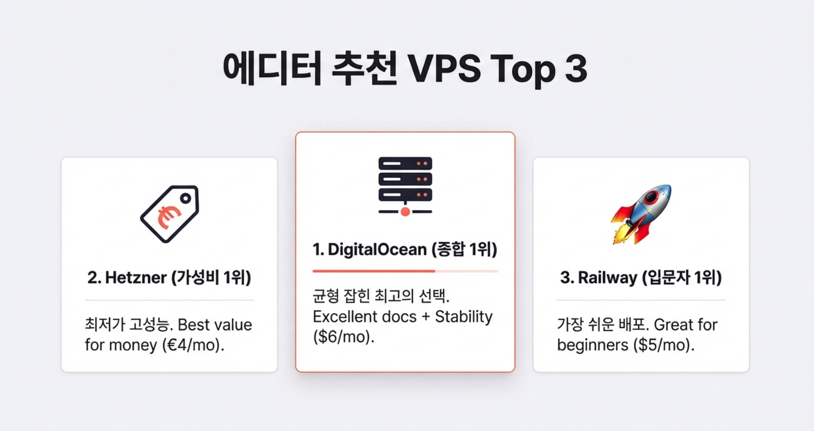  
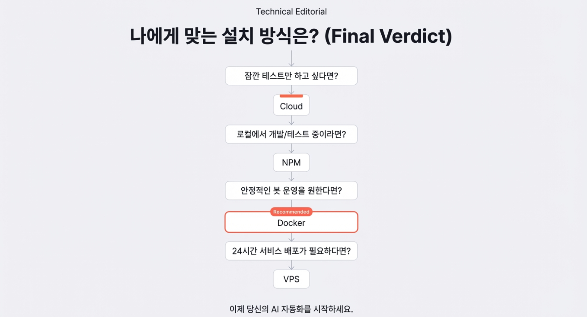  

