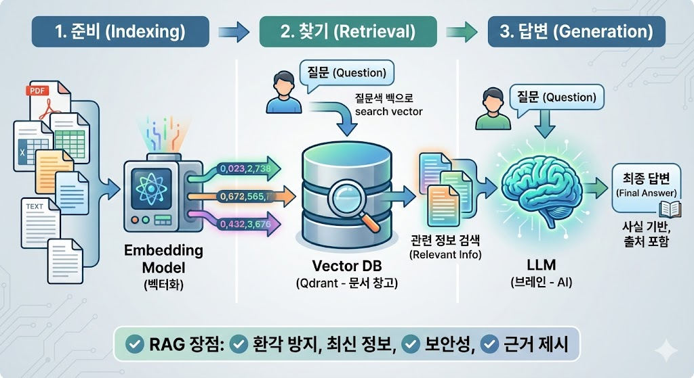

**RAG(Retrieval-Augmented Generation, 검색 증강 생성)**는 한마디로 말해 **"AI에게 참고서를 주고 시험을 보게 하는 기술"**입니다.

보통 챗GPT 같은 인공지능은 자신이 학습한 데이터(기억)로만 대답합니다. 하지만 RAG를 사용하면 AI가 답변하기 직전에 필요한 최신 정보나 특정 문서(Qdrant 같은 데이터베이스에 저장된 자료)를 먼저 찾아보고, 그 내용을 바탕으로 답변하게 됩니다.


---

### 1. RAG의 작동 단계 (3단계)

RAG가 작동하는 과정은 우리가 도서관에서 리포트를 쓰는 과정과 매우 비슷합니다.

| 단계 | 과정 | 설명 |
| --- | --- | --- |
| **1. 준비 (Indexing)** | **데이터 벡터화** | 방대한 문서들을 잘게 쪼개어 AI가 이해할 수 있는 숫자(벡터)로 변환해 **Qdrant** 같은 DB에 저장합니다. |
| **2. 찾기 (Retrieval)** | **관련 정보 검색** | 사용자가 질문을 하면, DB에서 질문과 가장 관련 있는 문서 조각들을 초고속으로 찾아냅니다. |
| **3. 답변 (Generation)** | **최종 답변 생성** | 찾아낸 정보와 질문을 함께 AI(LLM)에게 전달합니다. "이 정보를 참고해서 답변해줘"라고 요청하는 것이죠. |

---

### 2. 왜 RAG가 필요한가요? (장점)

일반 AI 모델만 사용할 때보다 다음과 같은 강력한 장점이 있습니다.

* **환각(Hallucination) 방지:** AI가 모르는 내용을 지어내는 것을 방지합니다. "여기 써진 내용만 보고 말해"라고 제한할 수 있기 때문입니다.
* **최신 정보 반영:** AI를 새로 학습(Fine-tuning)시키지 않아도, DB에 새로운 문서만 넣으면 즉시 최신 정보를 바탕으로 대답합니다.
* **보안 및 전문성:** 우리 회사의 내부 문서, 보안 지침 등 외부로 유출되면 안 되는 특정 데이터를 AI가 학습하지 않고도 활용하게 만들 수 있습니다.
* **근거 제시:** AI가 답변의 출처를 밝힐 수 있어 신뢰도가 높아집니다. (예: "매뉴얼 3페이지에 따르면...")

---

### 3. RAG를 만드는 3총사

RAG 시스템을 구축하려면 보통 다음 세 가지 요소가 필요합니다.

1. **Embedding Model (번역가):** 텍스트를 숫자로 바꿔주는 역할을 합니다. (OpenAI의 text-embedding-3 등)
2. **Vector Database (창고):** 숫자로 변환된 데이터를 저장하고 검색합니다. **(방금 설치하신 Qdrant가 이 역할입니다!)**
3. **LLM (브레인):** 최종적으로 정보를 읽고 답변을 구성합니다. (GPT-4, Claude 등)

---

**임베딩(Embedding)**은 앞서 설명해 드린 RAG 시스템에서 **'번역가'** 역할을 하는 핵심 기술입니다. 인간의 언어(텍스트)를 AI가 계산할 수 있는 **숫자 배열(벡터)**로 변환하는 과정을 말합니다.

더 쉽게 이해하실 수 있도록 임베딩의 원리와 주요 모델들을 정리해 드릴게요.

---

### 1. 임베딩의 원리: "의미를 좌표로 바꾸기"

임베딩 모델은 단어나 문장을 수백~수천 개의 숫자로 이루어진 좌표 값으로 변환합니다.

* **의미적 유사성:** 비슷한 의미를 가진 단어들은 좌표 공간에서 서로 **가까운 위치**에 배치됩니다.
* **예시:** "왕"과 "여왕"은 가깝게 위치하고, "왕"과 "사과"는 멀리 떨어지게 됩니다.
* **다차원 공간:** 우리가 사는 세상은 3차원이지만, 임베딩은 보통 768차원이나 1536차원 같은 고차원 공간을 사용하여 아주 미세한 의미의 차이까지 구분해냅니다.


---

### 2. 주요 임베딩 모델 비교

현재 가장 많이 쓰이는 모델들은 크게 유료 API 방식과 오픈소스 방식으로 나뉩니다.

| 모델 종류 | 대표 모델 | 특징 | 비고 |
| --- | --- | --- | --- |
| **OpenAI** | `text-embedding-3-small` / `large` | 가장 대중적이며 성능이 뛰어남. 다국어 지원이 강력함. | 유료 (API 호출당 비용) |
| **HuggingFace** | `BAAI/bge-m3`, `jhgan/ko-sroberta-multitask` | 한국어 특화 모델이 많으며, 로컬 서버에 직접 설치 가능. | 무료 (오픈소스) |
| **Google** | `text-embedding-004` | 구글 클라우드(Vertex AI) 환경에서 최적화됨. | 유료 |
| **Cohere** | `embed-multilingual-v3` | 기업용 검색 및 RAG 성능이 매우 우수함. | 유료 |

---

### 3. 임베딩 방식 (Method)

데이터를 어떻게 처리하느냐에 따라 크게 두 가지 방식으로 나뉩니다.

#### **① 밀집 임베딩 (Dense Embedding)**

* **특징:** 문장의 **맥락과 의미**를 파악합니다.
* **장점:** "자동차"라고 검색해도 "승용차"나 "탈것"이 포함된 문서를 찾아낼 수 있습니다. (유사어 검색 가능)
* **도구:** OpenAI, HuggingFace 모델들이 주로 이 방식을 씁니다.

#### **② 희소 임베딩 (Sparse Embedding)**

* **특징:** 특정 **키워드의 등장 빈도**를 기반으로 점수를 매깁니다. (전통적인 검색 방식)
* **장점:** 아주 고유한 고유명사나 제품 번호 등을 찾을 때 정확도가 높습니다.
* **도구:** BM25 알고리즘이 대표적입니다.

> **💡 하이브리드 검색(Hybrid Search):** 최근에는 이 두 방식을 섞어서 사용합니다. **Qdrant**는 이 두 방식을 동시에 지원하여 검색 정확도를 극대화할 수 있는 강력한 기능을 갖추고 있습니다.

---

### 4. 어떤 모델을 선택해야 할까요?

1. **빠르고 간편하게 시작하고 싶다면:** **OpenAI (`text-embedding-3-small`)**를 추천합니다. n8n에서도 API 키만 넣으면 바로 쓸 수 있어 설정이 가장 쉽습니다.
2. **데이터 보안이 중요하거나 비용이 걱정된다면:** **HuggingFace**의 한국어 특화 모델을 내 서버(로컬)에 올려서 사용하는 것을 추천합니다.
3. **한국어 전문 성능을 원한다면:** 한국어 데이터로 튜닝된 `ko-sbert` 계열의 모델을 고려해 보세요.


임베딩(Embedding)을 할 때 데이터를 무작정 넣는 것이 아니라, 적절한 크기로 자르는 과정이 반드시 필요합니다. 이때 등장하는 개념이 **청크(Chunk)**와 이를 효율적으로 수행하는 도구인 **RecursiveCharacterTextSplitter**입니다.

---

### 1. 청크(Chunk)란 무엇인가요?

**청크(Chunk)**는 커다란 수박을 한입에 먹기 좋게 조각낸 '덩어리'를 의미합니다. 방대한 문서 데이터를 AI가 처리하기 좋은 크기로 쪼갠 단위입니다.

#### **왜 청크로 나누어야 할까요?**

* **LLM의 한계:** AI 모델(GPT 등)은 한 번에 읽을 수 있는 텍스트 양(Context Window)에 제한이 있습니다.
* **검색 정확도:** 문서 전체를 임베딩하면 세부 내용이 희석됩니다. 필요한 부분만 콕 집어 찾으려면 잘게 나누어져 있어야 합니다.
* **비용 효율성:** 필요한 부분만 AI에게 전달하면 토큰 사용량을 줄여 비용을 아낄 수 있습니다.


---

### 2. RecursiveCharacterTextSplitter (재귀적 문자 텍스트 분할기)

이 도구는 LangChain 등에서 가장 권장되는 텍스트 분할 방식입니다. 단순히 글자 수대로 뚝 끊는 것이 아니라, **문맥을 최대한 보존하며** 재귀적으로 텍스트를 나눕니다.

#### **작동 원리**

이 분할기는 기본적으로 다음과 같은 구분자(Separator) 목록을 순서대로 시도하며 텍스트를 자릅니다:

1. `"\n\n"` (문단)
2. `"\n"` (줄바꿈)
3. `" "` (띄어쓰기)
4. `""` (글자 한 개)

**"문단 단위로 잘라보고, 그래도 너무 크면 문장 단위로, 그래도 크면 단어 단위로 잘게 쪼개 내려가는 방식"**입니다. 이 덕분에 문장의 중간이 뜬금없이 잘리는 일을 방지하고 의미를 최대한 유지합니다.

---

### 3. 핵심 파라미터 이해하기

설정할 때 가장 중요한 두 가지 옵션이 있습니다.

| 파라미터 | 설명 | 비유 |
| --- | --- | --- |
| **Chunk Size** | 각 청크가 가질 수 있는 최대 문자 수(또는 토큰 수)입니다. | **조각의 크기:** 한 조각을 얼마나 크게 썰 것인가? |
| **Chunk Overlap** | 인접한 두 청크 사이에 겹치는 부분의 크기입니다. | **겹쳐 쌓기:** 앞 조각의 끝부분을 뒤 조각에 포함해 문맥을 유지함. |

> **💡 Overlap이 왜 중요한가요?**
> 예를 들어 "이순신 장군은 / 거북선을 만들었다"라는 문장이 있을 때, 딱 절반으로 자르면 "이순신 장군은"과 "거북선을 만들었다"로 나뉘어 정보가 끊깁니다. 겹치는 구간(Overlap)을 두면 두 조각 모두에서 전체 맥락을 이해할 수 있게 됩니다.

---

### 4. 실제 설정 예시 (n8n 또는 Python)

보통 다음과 같은 수치를 기준으로 시작하여 데이터 특성에 맞춰 조정합니다.

* **Chunk Size:** 500 ~ 1000 (일반적인 문서 기준)
* **Chunk Overlap:** 100 ~ 200 (약 10~20% 정도 겹침)

```python
# 예시 설정 코드
splitter = RecursiveCharacterTextSplitter(
    chunk_size = 1000,
    chunk_overlap  = 200,
    length_function = len,
)

```

---

### 요약하자면

* **Chunk:** 검색 성능을 높이기 위해 문서를 쪼갠 단위.
* **Recursive:** 문맥을 지키기 위해 문단 -> 문장 -> 단어 순으로 똑똑하게 자르는 방식.
* **Overlap:** 정보의 단절을 막기 위해 조각끼리 살짝 겹치게 만드는 기술.

**벡터 데이터베이스(Vector Database)**는 텍스트, 이미지, 비디오와 같은 비정형 데이터를 숫자의 배열인 **'벡터(Vector)'**로 변환하여 저장하고, 이를 초고속으로 검색하기 위해 최적화된 특수 데이터베이스입니다.

기본적인 데이터베이스(SQL)가 "이름이 '홍길동'인 사람을 찾아줘"라는 **정확한 일치(Exact Match)**를 수행한다면, 벡터 데이터베이스는 "이 문장과 **의미가 가장 비슷한** 문서를 찾아줘"라는 **유사도 검색(Similarity Search)**을 수행합니다.

---

### 1. 일반 DB vs 벡터 DB 차이점

| 구분 | 일반 관계형 DB (SQL) | 벡터 데이터베이스 |
| --- | --- | --- |
| **데이터 형태** | 표(Table), 텍스트, 숫자 | 고차원 숫자 배열 (Embedding) |
| **검색 방식** | 키워드 일치, 조건문 (WHERE) | 벡터 간의 거리 계산 (유사도) |
| **주요 목적** | 데이터 관리 및 트랜잭션 | AI 기반 검색, 추천, RAG |
| **비유** | 사전에서 단어 찾기 | 도서관에서 비슷한 내용의 책 찾기 |


---

### 2. 어떻게 작동하나요?

1. **임베딩(Embedding):** AI 모델을 이용해 비정형 데이터를 수천 개의 숫자로 이루어진 벡터로 변환합니다.
2. **저장(Storage):** 변환된 벡터와 함께 원본 데이터의 정보(메타데이터, Qdrant에서는 '페이로드')를 함께 저장합니다.
3. **색인(Indexing):** 방대한 벡터들 사이에서 빠르게 길을 찾을 수 있도록 특수한 지도를 만듭니다. (예: HNSW 알고리즘 등)
4. **검색(Querying):** 질문을 벡터로 변환한 뒤, DB 안에 저장된 벡터들 중 거리가 가장 가까운 것들을 찾아냅니다.

#### 💡 수학적 유사도 계산

벡터 간의 거리를 잴 때 주로 다음과 같은 수식을 사용합니다:

* **코사인 유사도 (Cosine Similarity):** 두 벡터 사이의 각도를 측정합니다. 
* **유클리드 거리 (Euclidean Distance):** 두 점 사이의 직선 거리를 측정합니다. 

---

### 3. 왜 지금 중요한가요? (핵심 역할)

현재 AI 분야에서 벡터 데이터베이스가 필수적인 이유는 크게 두 가지입니다.

* **AI의 '장기 기억' 장치:** LLM(GPT 등)은 한 번에 기억할 수 있는 양이 적습니다. 벡터 DB는 수백만 개의 문서를 저장해 두었다가 AI가 필요할 때마다 꺼내 쓸 수 있는 거대한 외부 메모리 역할을 합니다.
* **비정형 데이터의 이해:** 단순 키워드가 아니라 "슬픈 분위기의 음악", "이 사진과 구도가 비슷한 그림" 처럼 컴퓨터가 이해하기 힘든 추상적인 개념을 검색할 수 있게 해줍니다.

---

### 4. 대표적인 솔루션들

* **Qdrant (쿼드런트):** 사용자님이 사용 중이신 솔루션으로, 성능과 확장성이 뛰어나며 Rust로 작성되었습니다.
* **Pinecone:** 클라우드 네이티브 서비스로 설정이 매우 간편합니다.
* **Milvus:** 대규모 엔터프라이즈 환경에 적합한 오픈소스 프로젝트입니다.
* **Chroma:** 가볍고 간단하여 파이썬 환경에서 프로토타입을 만들 때 인기가 많습니다.