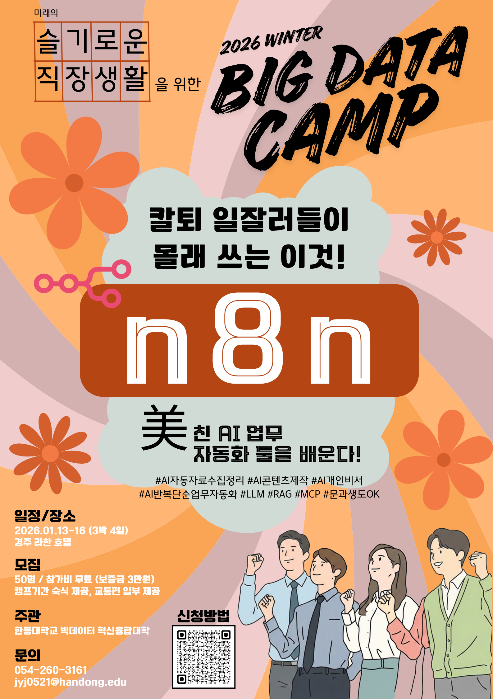

# Learning contents 

## [Day 1]
[n8n의 시작](./1/1-1/01-01.n8n의%20시작.md)  
[n8n 환경의 구성](./1/1-2/1-2.n8n의%20설치.md)  
[Lab 1: n8n의 설치](./1/1-2-Lab/1-2-1-lab-n8n%20설치(Docker).md)   
[Lab 2: n8n의 사용법 및 주요 노드의 소개](./1/1-2-Lab/1-2-2-lab_n8n%20사용법%20및%20주요%20노드의%20소개.md)  
[Lab 3: First Workflow](./1/1-2-Lab/1-2-3-lab-First%20Workflow.md)  

## [Day 2]
[인스타그램 분석](./2/2-1/2-1%20인스타그램%20분석기.md)  
[IT News Summary](./2/2-2/2-1%20ITNews.md)  
[AI Agent](./2/2-3/2-3%20AI%20agent.md)  

## [Day 3]
[RAG 개념소개](./3/3-1%20Lab/3-1%20RAG.md)  
[Lab 1 RAG](./3/3-1%20Lab/3-1%20Lab%20RAG.md)  
[Lab 2 교보문고 베스트셀러 Agent](./3/3-2%20Lab%20교보문고%20베스트셀러/3-2%20교보문고%20베스트셀러%20Agent.md)

# 용어 사전
[용어사전](./용어사전/)  

# 강사소개

[김영욱](./강사소개/강사소개.md)
