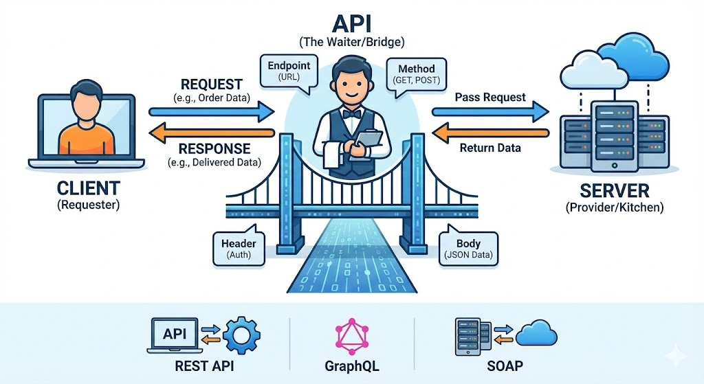

**API(Application Programming Interface)**는 현대 디지털 세상에서 서로 다른 소프트웨어들이 대화할 수 있게 해주는 **'중계자' 또는 '연결 고리'**입니다.

쉽게 비유하자면, 식당에서 손님(사용자)이 메뉴를 보고 요리(데이터/기능)를 주문하면, 이를 주방(서버)에 전달하고 완성된 음식을 다시 손님에게 가져다주는 **'점원'**과 같은 역할을 합니다.

API의 개념부터 작동 원리, 종류까지 꼼꼼하게 정리해 드립니다.

  
---

## 1. API의 핵심 개념

API는 프로그램과 프로그램이 정보를 주고받기 위해 약속된 **규칙의 집합**입니다. 개발자가 복잡한 내부 로직을 몰라도, API가 제공하는 규칙만 따르면 상대방의 기능을 빌려 쓸 수 있습니다.

### API가 필요한 이유

* **효율성:** 모든 기능을 직접 개발할 필요 없이, 이미 잘 만들어진 기능을 가져다 쓸 수 있습니다. (예: 지도 기능, 결제 시스템)
* **보안:** 서버의 전체 데이터베이스를 개방하지 않고, API를 통해 필요한 데이터만 선별적으로 제공하여 보안을 유지합니다.
* **표준화:** 서로 다른 프로그래밍 언어로 만들어진 시스템끼리도 정해진 규칙(API)만 맞추면 원활하게 소통할 수 있습니다.

---

## 2. API의 작동 원리 (Request & Response)

API 통신은 크게 **요청(Request)**과 **응답(Response)**의 과정으로 이루어집니다.

1. **클라이언트(요청자):** "이 데이터(또는 기능) 좀 줄래?"라고 API 형식에 맞춰 요청을 보냅니다.
2. **API:** 요청을 받고 서버에게 전달합니다. 이때 요청이 유효한지(인증/인가) 확인합니다.
3. **서버(제공자):** 요청받은 작업을 수행하고 결과를 API에게 돌려줍니다.
4. **API:** 서버로부터 받은 결과(데이터)를 다시 클라이언트에게 전달합니다.

---

## 3. API의 주요 구성 요소

API를 호출할 때 흔히 접하게 되는 용어들입니다.

| 구성 요소 | 설명 | 예시 |
| --- | --- | --- |
| **Endpoint (엔드포인트)** | API가 자원에 접근할 수 있는 최종 목적지(URL)입니다. | `https://api.example.com/v1/users` |
| **Method (메서드)** | 어떤 동작을 할지 정의합니다. (HTTP 메서드) | `GET`(조회), `POST`(생성), `PUT`(수정), `DELETE`(삭제) |
| **Header (헤더)** | 요청에 대한 부가 정보나 인증 정보를 담습니다. | `Content-Type: application/json`, `Authorization: Bearer <Token>` |
| **Parameter (파라미터)** | 요청 시 함께 전달하는 세부 조건입니다. | `?id=123`, `/users/{userid}` |
| **Body (바디)** | 서버로 보낼 실제 데이터 본문입니다. (주로 JSON 형식) | `{"name": "Gemini", "email": "test@test.com"}` |

---

## 4. API의 통신 방식 (아키텍처)

가장 많이 쓰이는 방식들을 비교해 보세요.

[Image comparing REST, GraphQL, and SOAP APIs]

* **REST (Representational State Transfer):** 현재 가장 널리 쓰이는 표준입니다. 자원(Resource)을 이름으로 구분하고, HTTP 메서드를 통해 상태를 주고받습니다. 구조가 단순하고 이해하기 쉽습니다.
* **GraphQL:** 클라이언트가 **정확히 필요한 데이터만** 요청할 수 있는 방식입니다. REST의 '데이터 과다 호출' 문제를 해결해 줍니다.
* **SOAP (Simple Object Access Protocol):** 보안이나 트랜잭션 처리가 엄격해야 하는 금융권 등에서 주로 사용하며, XML 기반으로 복잡한 편입니다.
* **gRPC:** 구글에서 개발한 방식으로, 매우 빠르고 효율적인 데이터 전송이 가능해 마이크로서비스 아키텍처(MSA)에서 주로 쓰입니다.

---

## 5. 접근 권한에 따른 분류

* **Private API:** 회사 내부에서만 사용하는 API입니다. 시스템 간의 연결을 위해 사용됩니다.
* **Partner API:** 비즈니스 파트너 관계인 특정 외부 업체에게만 허용된 API입니다.
* **Public (Open) API:** 누구나 접근하여 사용할 수 있도록 공개된 API입니다. (예: 공공데이터포털, 구글 지도 API, 카카오 로그인 API)

---

## 6. 실생활에서의 API 예시

* **간편 로그인:** "카카오톡으로 로그인하기" 버튼을 누르면, 웹사이트가 카카오의 API를 호출하여 사용자의 기본 정보를 안전하게 가져옵니다.
* **날씨 앱:** 스마트폰의 날씨 앱은 기상청이나 날씨 서비스 업체의 API로부터 실시간 기상 데이터를 받아와 보여줍니다.
* **배달 앱:** 배달 앱 내의 지도는 구글이나 네이버의 지도 API를 빌려와서 사용자의 위치를 표시합니다.