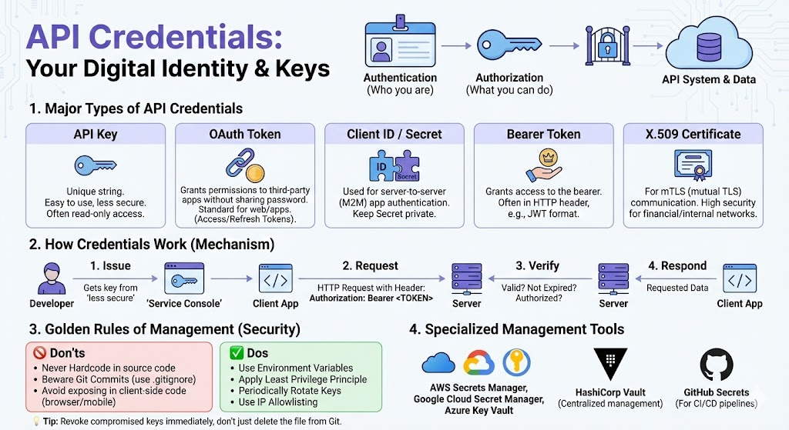

IT 보안 및 개발 분야에서 **크리덴셜(Credentials)**은 시스템이나 API에 접근할 때 "내가 누구인지(인증)"와 "어떤 권한이 있는지(인가)"를 증명하는 **디지털 신분증 또는 열쇠**를 의미합니다.

API 환경에서 사용되는 주요 크리덴셜의 종류와 보안 관리 원칙을 상세히 정리해 드립니다.

---

## 1. 주요 API 크리덴셜의 종류

API 크리덴셜은 사용 목적과 보안 요구 수준에 따라 여러 형태로 나뉩니다.

| 종류 | 설명 | 특징 |
| --- | --- | --- |
| **API Key** | 서비스 제공자가 발급하는 고유한 문자열입니다. | 구현이 매우 쉽지만, 유출 시 보안에 취약합니다. 보통 읽기 전용 데이터 접근 등에 사용됩니다. |
| **OAuth Token** | 제3자 앱에 권한을 부여하는 표준 방식입니다. (Access/Refresh Token) | 사용자의 비밀번호를 직접 공유하지 않고 특정 권한만 부여할 수 있어 현대 웹/앱에서 가장 선호됩니다. |
| **Client ID / Secret** | 서버 대 서버(M2M) 통신에서 앱 자체를 인증할 때 사용합니다. | 아이디/비밀번호와 유사하며, Client Secret은 절대 외부에 노출되어서는 안 됩니다. |
| **Bearer Token** | "이 토큰을 가진 자(Bearer)에게 권한을 준다"는 방식입니다. | 보통 HTTP 헤더에 담아 전송하며, 주로 JWT(JSON Web Token) 형식을 취합니다. |
| **X.509 인증서** | mTLS(상호 TLS) 통신에서 사용되는 디지털 인증서입니다. | 매우 높은 보안 수준이 필요한 금융권이나 내부 망 통신에서 주로 사용됩니다. |

---

## 2. 크리덴셜의 작동 메커니즘

보통 클라이언트(사용자 또는 앱)가 서버에 요청을 보낼 때, HTTP 헤더(`Authorization`)나 쿼리 파라미터에 크리덴셜을 포함하여 전달합니다.

1. **발급:** 개발자가 서비스 관리 콘솔에서 API 키 또는 클라이언트 비밀키를 발급받습니다.
2. **요청:** 클라이언트가 API를 호출할 때 헤더에 `Authorization: Bearer <TOKEN>` 식으로 크리덴셜을 담아 보냅니다.
3. **검증:** 서버는 수신한 크리덴셜이 유효한지, 만료되지 않았는지, 해당 요청을 수행할 권한이 있는지 확인합니다.
4. **응답:** 검증이 완료되면 요청한 데이터를 반환합니다.

---

## 3. 크리덴셜 관리의 '골든 룰' (보안 수칙)

크리덴셜이 유출되면 데이터 유출은 물론, 막대한 클라우드 비용 발생이나 시스템 파괴로 이어질 수 있습니다.

### 🚫 절대 하지 말아야 할 것 (Don'ts)

* **하드코딩 금지:** 소스 코드 안에 직접 API 키를 적어넣지 마세요.
* **Git 커밋 주의:** `.env` 파일이나 설정 파일을 실수로 GitHub 등 공용 저장소에 올리지 않도록 `.gitignore` 설정을 철저히 해야 합니다.
* **클라이언트 측 노출 자제:** 브라우저(Javascript)나 모바일 앱 코드 내부에 중요한 Secret 값을 직접 넣으면 역컴파일을 통해 쉽게 탈취될 수 있습니다.

### ✅ 반드시 해야 할 것 (Dos)

* **환경 변수(Environment Variables) 사용:** 운영체제나 실행 환경의 변수로 관리합니다.
* **최소 권한 원칙(Least Privilege):** 해당 API 키가 꼭 필요한 작업만 할 수 있도록 권한 범위를 최소화합니다.
* **주기적 갱신(Rotation):** 크리덴셜을 정기적으로 교체하여 유출 시 피해를 최소화합니다.
* **IP 화이트리스팅:** 특정 서버 IP에서 오는 요청만 허용하도록 제한합니다.

---

## 4. 전문적인 크리덴셜 관리 도구

기업 환경에서는 안전한 관리를 위해 전용 솔루션을 사용합니다.

* **Secrets Manager:** AWS Secrets Manager, Google Cloud Secret Manager, Azure Key Vault 등 클라우드 제조사 서비스.
* **HashiCorp Vault:** 인프라 전반의 비밀 정보를 중앙에서 관리하고 동적으로 발급해 주는 강력한 도구.
* **GitHub Secrets:** CI/CD 파이프라인(Github Actions)에서 안전하게 크리덴셜을 주입할 때 사용.

---

> **💡 보안 팁:** 만약 실수로 GitHub에 API 키를 올렸다면, 단순히 파일을 삭제하고 다시 커밋하는 것으로는 부족합니다. **즉시 해당 키를 무효화(Revoke)하고 새로운 키를 발급**받아야 합니다. Git 히스토리에는 여전히 이전 키의 기록이 남아있기 때문입니다.
