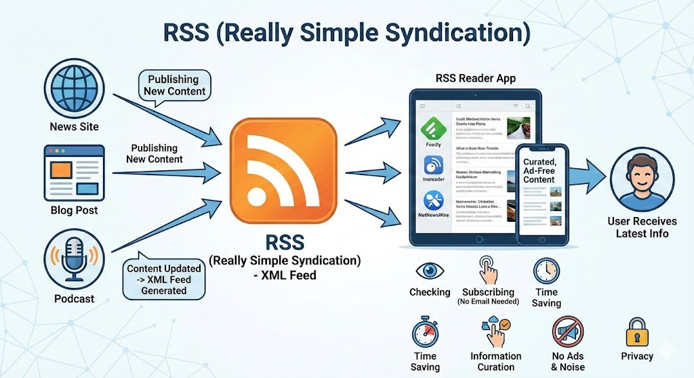

**RSS(Really Simple Syndication)**는 웹사이트의 업데이트된 정보를 사용자에게 쉽고 빠르게 전달하기 위해 만들어진 **콘텐츠 배급 포맷**입니다.

과거에는 즐겨 찾는 블로그나 뉴스 사이트의 새 글을 확인하기 위해 일일이 사이트를 방문해야 했지만, RSS를 활용하면 한곳에서 모든 업데이트 소식을 모아볼 수 있습니다. RSS에 대해 핵심적인 내용들을 상세히 정리해 드립니다.

  
---

## 1. RSS의 핵심 개념

RSS는 웹사이트의 정보를 **XML 기반**의 표준화된 형식으로 제공합니다. 이 형식을 통해 뉴스, 블로그 포스트, 팟캐스트 등의 콘텐츠 제목, 요약, 링크 등을 기계가 읽을 수 있는 형태로 배포합니다.

### RSS의 작동 원리

1. **발행(Publishing):** 웹사이트 운영자가 새 글을 올리면, 해당 사이트의 RSS 피드(XML 파일)가 자동으로 업데이트됩니다.
2. **수집(Subscribing):** 사용자는 **RSS 리더(Reader)** 앱에 관심 있는 사이트의 RSS 주소를 등록합니다.
3. **확인(Checking):** RSS 리더가 주기적으로 등록된 주소들을 확인하여 새로운 콘텐츠가 있는지 체크하고, 업데이트가 있으면 사용자에게 보여줍니다.

---

## 2. RSS의 주요 장점

| 구분 | 주요 이점 |
| --- | --- |
| **시간 절약** | 수십 개의 사이트를 일일이 방문할 필요 없이 한 곳에서 모든 새 소식을 확인합니다. |
| **정보의 선별** | 알고리즘에 의한 추천이 아니라, **내가 직접 선택한 매체**의 정보만 구독합니다. |
| **광고와 소음 제거** | 웹사이트의 복잡한 레이아웃이나 광고 없이 텍스트와 이미지 중심의 깔끔한 형태로 읽을 수 있습니다. |
| **프라이버시** | 이메일 구독(뉴스레터)과 달리 개인정보를 제공할 필요가 없으며, 구독 해지도 리더 앱에서 삭제만 하면 끝납니다. |

---

## 3. RSS 사용 방법

RSS를 사용하기 위해서는 정보를 모아주는 **'RSS 리더(RSS Reader)'** 또는 **'애그리게이터(Aggregator)'** 프로그램이 필요합니다.

### 추천하는 RSS 리더 도구

* **Feedly (피들리):** 가장 대중적이고 UI가 깔끔한 웹 기반 리더입니다.
* **Inoreader (이노리더):** 강력한 필터링 기능과 검색 기능을 제공하여 파워 유저들에게 인기가 많습니다.
* **NetNewsWire (macOS/iOS):** 애플 기기 사용자들 사이에서 매우 빠른 속도와 네이티브 디자인으로 유명합니다.
* **Reeder:** 유료 앱이지만 디자인이 유려하고 읽기 경험이 뛰어납니다.

### 구독 단계

1. RSS 리더 앱을 설치하거나 웹사이트에 가입합니다.
2. 구독하고 싶은 블로그나 뉴스 사이트에서 RSS 아이콘()을 찾거나 사이트 주소를 복사합니다.
3. 리더 앱의 'Add Content' 또는 'Subscribe' 메뉴에 주소를 입력합니다.

---

## 4. RSS의 현재와 변화 (SNS와의 차이)

페이스북, 트위터(X), 알고리즘 기반의 포털 뉴스가 등장하면서 RSS의 인기가 예전만 못하다는 평가도 있었습니다. 하지만 최근 **'정보 과잉'**과 **'필터 버블(보고 싶은 것만 보게 되는 현상)'**에 지친 사람들이 다시 RSS로 돌아오는 추세입니다.

* **SNS:** 알고리즘이 추천하는 자극적인 콘텐츠 위주로 노출되며, 시간 순서가 뒤섞이는 경우가 많습니다.
* **RSS:** 철저하게 **시간 역순(최신순)**으로 나열되며, 사용자가 구독한 정보만 누락 없이 보여줍니다.

---

## 5. RSS 피드 주소 찾는 팁

대부분의 현대적인 웹사이트는 RSS를 지원합니다.

* **티스토리/네이버 블로그:** `블로그주소/rss` 형태로 제공됩니다.
* **워드프레스:** `사이트주소/feed` 형태가 기본입니다.
* **유튜브:** 특정 채널의 URL을 RSS 리더에 붙여넣으면 해당 채널의 새 영상 소식을 받을 수 있습니다.